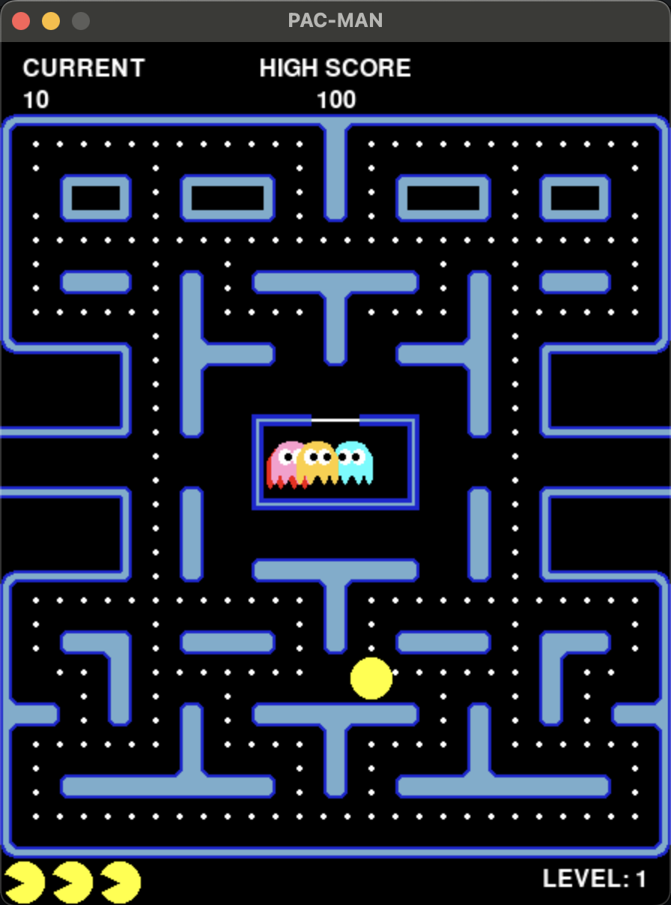
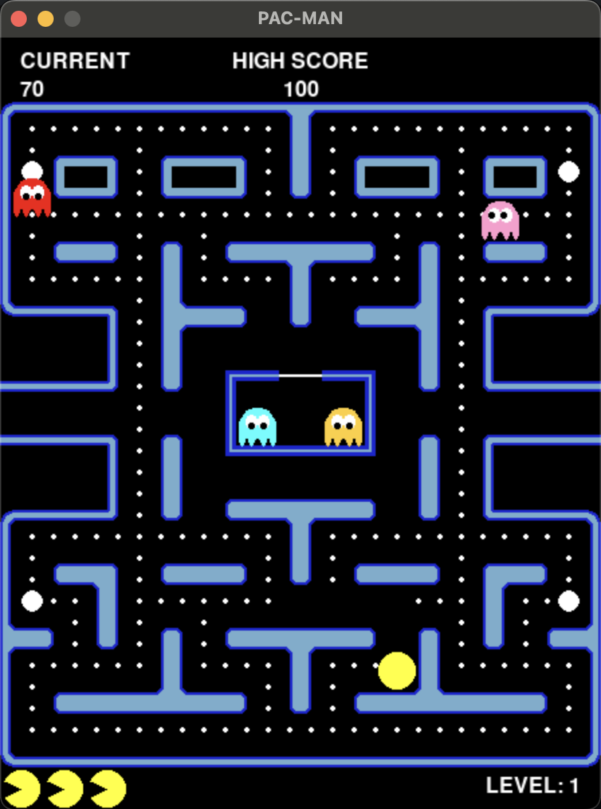

# pac-man

Welcome to the classic pac-man game.

<div style="display: flex; justify-content: space-between;">
    
    
    
</div>

## How to Play

- Use mouse to start a new game.
- Use the **arrow keys** on your keyboard to move Pacman up, down, left, or right.
- To quit the game, press the **Q** key or close the game window.

## Game Rules

- Eat all the dots to complete the level and advance to the next one.
- Avoid the ghosts! If they catch Pacman, you lose a life.
- Collect power pellets to make the ghosts vulnerable. When vulnerable, you can eat ghosts for extra points.
- The game ends when all lives are lost. Highest Score is saved.

## Points Breakdown

The point system adheres to the original score system from pac-man.

- pellets: 10 points
- power pellets: 50 points
- ghosts: 200 points

## Instructions

For this program to work, you need Python, Pygame and Numpy installed.

A requirements file is provided as well as a bash file to create a virtual
environment and install all the necessary packages

```bash
sh run_venv.sh
```

The main file is game.py, to run program use the command:

```python
python3 game.py
```
